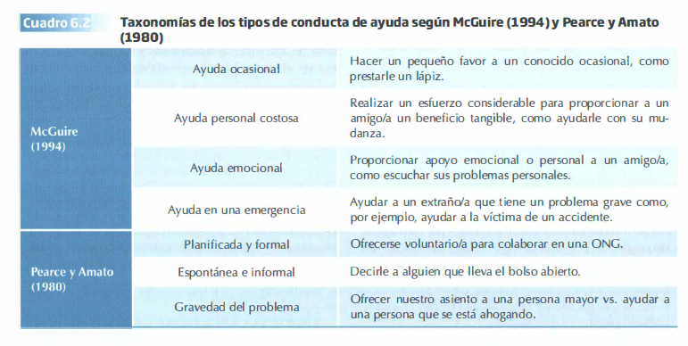
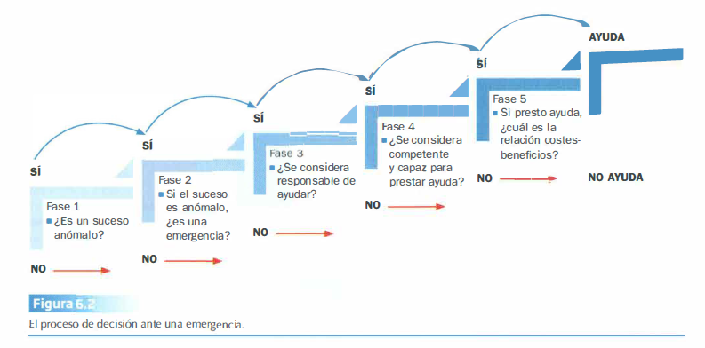
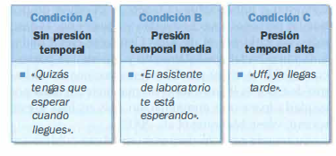
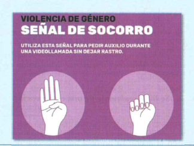
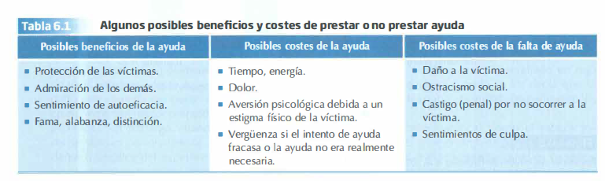
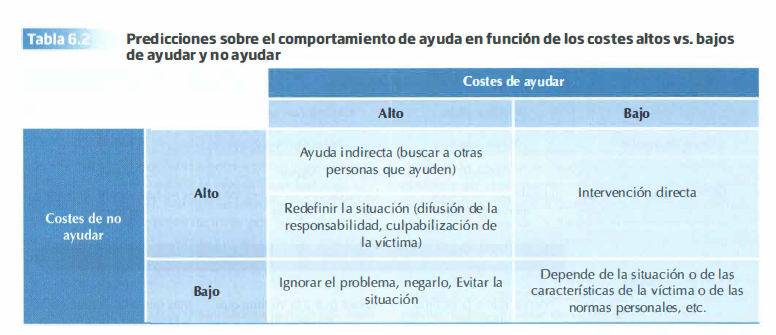
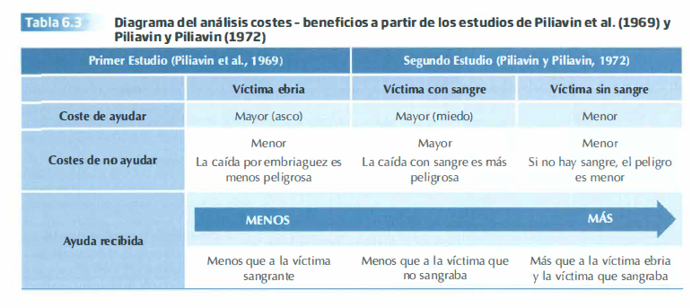
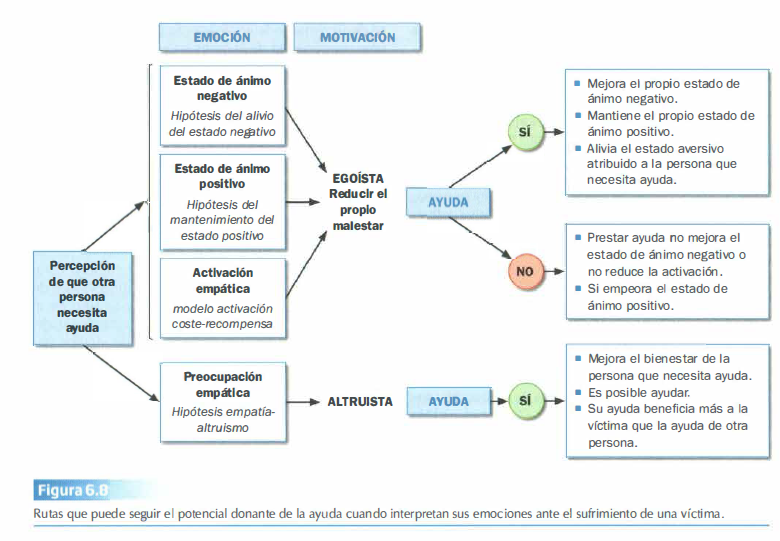

--- 
title: "Resumen del Tema 6 de Psicología Social"
subtitle: "CONDUCTA DE AYUDA"
author: ""
date: "`r Sys.Date()`"
site: bookdown::bookdown_site
documentclass: book
#bibliography: [book.bib, packages.bib]
# url: your book url like https://bookdown.org/yihui/bookdown
# cover  -image: path to the social sharing image like images/cover.jpg
description: |
 Este resumen del tema es sólo para uso como material de apoyo en las tutorías. Para estudiar y preparar el examén  se recomienda usar el libro referenciado en la guía docente de la asignatura.
link  -citations: yes
github  -repo: dalarconrub/psicologia  -social  -tema  -6

output:
  prettydoc::html_pretty:
    theme: hpstr
    highlight: github
    toc: true
   
---

---
# [Psicología Social](https://dalarconrub.github.io/psicologia  -social/)

**Este resumen del tema es sólo para uso como material de apoyo en las tutorías. Para estudiar y preparar el examén  se recomienda usar el libro referenciado en la guía docente de la asignatura**

# TEMA 6: CONDUCTA DE AYUDA

Uno de los objetivos de la Psicología Social es explicar qué lleva a las personas a realizar actos de heroísmo y de valentía inusuales, a sacrificarse por otros y a defender la justicia. Esto está vinculado a la Psicología Positiva, que se centra en el análisis de los mejores aspectos de la conducta humana en lugar de focalizarse en el estudio de la patología y el malestar.  

Sin embargo, el comportamiento prosocial también puede conllevar culpar a las víctimas o que el motivo de la ayuda sea egoísta o simplemente sentirse mejor.  

# 1. Comportamiento prosocial, conducta de ayuda, altruismo y coraje civil

La **conducta prosocial** es una amplia categoría de actos que son definidos por la cultura en la que vivimos como beneficiosos para otras personas (ayudar a una persona que lo necesita, ofrecerse voluntario para una buena causa) y para la sociedad en general (proteger el medio ambiente).  

La conducta prosocial no requiere que el objetivo de la conducta sea el bienestar propio, sino que lo que importa es la aprobación de los demás, un hecho que convierte al comportamiento prosocial en un fenómeno normativo (Pfattheicher et al., 2022).  

#### Subcategorías de la conducta prosocial
Para distinguir entre los diferentes tipos de actos prosociales, hay cuatro subcategorías:

#### Conducta de ayuda
- Conducta que proporciona un beneficio o mejora el bienestar de otra persona.
- Casi todas las definiciones se basan en la perspectiva del benefactor.
- Para que un comportamiento se considere de ayuda hacen falta dos condiciones:
  1. **Debe beneficiar a los demás** y el beneficio tiene que ser algo que se ha intentado conseguir expresamente.
  2. **La conducta tiene que ser voluntaria.**

**Ejemplo:**  
- Si perdemos un billete de 50€ y:  
  - Quien se lo encuentra lo gasta → **NO HAY CONDUCTA DE AYUDA.**  
  - Le da el dinero a su vecino que lo necesita → **SÍ HAY CONDUCTA DE AYUDA.**  

**Otras características:**  
- Puede o no requerir un contacto personal con el receptor:  
  - **Ayuda directa:** Ayuda personal.  
  - **Ayuda indirecta:** Donar a una ONG.  
- Puede implicar o no la anticipación de recompensas externas.  
- Las conductas pueden ser:  
  - **Sencillas:** Dar la hora.  
  - **Difíciles:** Apartar a un niño de la trayectoria de un coche que va muy rápido.  
 
**Puntos importantes sobre la conducta de ayuda:**  
1. No toda la conducta de ayuda es igual.  
2. Los factores que afectan a la conducta de ayuda en unas situaciones no tienen los mismos efectos en otras.  

#### Altruismo
- Desde la Psicología Social: un comportamiento voluntario e intencionado, motivado por valores relacionados con la preocupación por los demás, cuyo fin es beneficiar a otras personas, sin tener en cuenta ni las recompensas que se puedan obtener ni los costes personales que pueda conllevar esta acción.
- Influido por factores motivacionales: la motivación interna del actor es una de las características definitorias del altruismo.

**Características:**
- Puede variar desde actos que implican menos sacrificio para el actor (donar sangre) hasta otros que pueden tener consecuencias personales mortales (ser voluntario para atender a víctimas del ébola).
- Es lo opuesto al egoísmo, cuya motivación principal es aumentar el bienestar propio.

**Desde otras disciplinas:**
- Desde la Economía, Psicología Evolutiva o Etología, los motivos e intenciones de un individuo altruista son irrelevantes. Estas disciplinas explican el altruismo focalizándose en los costes y beneficios que supone para el donante y el receptor.

**Para los etólogos:**
- Un comportamiento altruista es aquel que aumenta la probabilidad de que los parientes genéticos cercanos sobrevivan y se reproduzcan, transmitiendo así sus genes a las generaciones sucesivas.

#### Coraje moral o coraje civil
Defensa pública de valores y normas morales, que suele asociarse a consecuencias sociales negativas.

**Ejemplos:**  
    - Denunciar prácticas discriminatorias de un colega.  
    - Intervenir en el espacio público en defensa de un bien mayor.  
    - Denunciar prácticas ilegales dentro de las organizaciones (*whistleblowing*).  

**Whistleblowing:**  
    - El término proviene de la policía británica que usaban silbatos (*whistle*) para alertar de delitos.  
    - Hoy, describe a personas que denuncian delitos, peligros o fraudes que están siendo silenciados por otros miembros de un grupo.  

**Casos destacados:**  
  - Edward Snowden, Chelsea Manning y Julian Assange. 
 
**Identidad social y motivación:**  
  - La probabilidad de denunciar depende de si los individuos se identifican más con:  
    - **Categorías de nivel inferior:** Grupo infractor.  
    - **Categorías de nivel superior:** Organización o profesión.  

**Factores que influyen:**  
1. Identificarse fuertemente con el grupo infractor reduce la probabilidad de denunciar:  
     - Mayor tolerancia a las infracciones del grupo.  
     - Mayor presión social para conformarse y ser cómplice.  
     - Temor a las consecuencias negativas para el grupo y el infractor.  
2. Identificarse con la categoría superior aumenta la probabilidad de denunciar irregularidades porque las malas prácticas internas violan los valores de la organización o profesión.  

Los actos moralmente valientes suelen tener una naturaleza de confrontación (denunciar a transgresores) con el único objetivo de rectificar lo que se ha hecho mal y así contribuir a un bien mayor.  
▪ No requiere necesariamente una víctima.     
▪ Consecuencias sociales negativas.  
▪ Agresor percibido como amenazante.  

**Diferencias con el heroísmo:**  
  - **Coraje civil:** Consecuencias sociales negativas, enfrentamiento con un agresor.  
  - **Heroísmo:** Consecuencias sociales positivas, admiración pública.  

#### Cooperación
Implica a dos o más personas que trabajan interdependientemente hacia un objetivo común que beneficiará a todos los implicados.

**Características:**  
  - No existe jerarquía ni poder.   
  - Todos obtienen recompensas comunes.  
  - Fomenta la cohesión grupal y mejora las relaciones interpersonales.  

**Investigación actual:**  
  - Se centra en dilemas sociales, que presentan dos características fundamentales:  
    1. Cada individuo recibe una recompensa mayor por no cooperar (*desertar*), pero esto perjudica al grupo.  
    2. Todos los individuos están mejor si cooperan que si desertan.  
   
**Diferencias con la conducta de ayuda y el altruismo:**  
  - Estos implican un *desequilibrio* entre receptor y donante, donde el receptor necesita ayuda y el donante tiene los recursos.  
  - Puede generar la percepción de que el benefactor asume una posición de poder, haciendo que el receptor se sienta obligado a devolver el favor.

##### El comportamiento prosocial o la conducta de ayuda

El **comportamiento prosocial** o la **conducta de ayuda** no siempre está motivado únicamente por el altruismo.  

Por ejemplo, una madre que lleva en coche a su hijo en un día lluvioso realiza una conducta de ayuda, pero no necesariamente está motivada exclusivamente por el altruismo.

#### Limitaciones de las definiciones
Las definiciones tradicionales de comportamiento prosocial no explican los mecanismos subyacentes a estos comportamientos. Es decir, continuamos sin comprender completamente **por qué las personas actúan, o no, de forma prosocial** en diferentes situaciones.

#### Perspectiva psicosocial: Tres enfoques principales

Desde la perspectiva psicosocial, el estudio del comportamiento prosocial se aborda desde tres dimensiones clave:  

  1. **Factores situacionales**  
   - Se enfoca en las condiciones externas o contextuales en lugar de los aspectos personales del individuo.  
  
  2. **Procesos psicológicos**  
   - Incluyen:
     - **Afectivos:** Emociones que motivan o inhiben la conducta prosocial.
     - **Cognitivos:** Procesos de razonamiento y evaluación que influyen en la toma de decisiones.  

  3. **Socialización y normas**  
   - Analiza cómo la cultura, las normas sociales y el aprendizaje a lo largo de la vida moldean las conductas de ayuda.  

# 2. Determinantes situacionales vs. disposicionales de la conducta de ayuda

En la década de los 60, los investigadores centraron sus esfuerzos en identificar los factores que mejor predecían la **conducta de ayuda**. Estas investigaciones tomaron dos enfoques principales:

  - **Psicólogos de la personalidad**: Se enfocaron en variables disposicionales como:
    - **Anomia**: Falta de integración o normas sociales.
    - **Maquiavelismo**: Tendencia a manipular y ser cínico.
    - **Responsabilidad social**: Preocupación por el bienestar de los demás.

  - **Psicólogos sociales**: Analizaron factores situacionales como:
    - Aspecto físico de la víctima.
    - Similitud con la víctima.
    - Número de transeúntes.
    - Coste de la ayuda.

#### Conclusiones iniciales
Los metaanálisis de la época concluyeron que los **factores situacionales** eran mejores predictores de la **conducta prosocial**. Sin embargo, investigaciones posteriores demostraron que los **rasgos de personalidad** también desempeñan un papel importante, especialmente en contextos donde los factores situacionales no son determinantes.

#### Rasgos de personalidad y conducta de ayuda

La investigación ha identificado ciertos rasgos que se relacionan con la conducta prosocial:

#### 1. **Amabilidad**
  - Incluye características como:
    - **Simpatía**, **generosidad**, **perdón** y **ayuda**.
  - Está relacionada con:
    - **Prosocialidad**, **empatía**, **voluntariado** y mayor probabilidad de realizar conductas de ayuda.
  - Las personas con altos niveles de amabilidad ayudan independientemente de:
    - Inducción de empatía.
    - Coste de la ayuda (alto o bajo).
    - Pertenencia de la víctima al endogrupo o exogrupo.

#### 2. **Honestidad  -Humildad**
  - Incluye cualidades como:
    - **Sinceridad**, **honestidad** e **imparcialidad**.
  - Se ha vinculado al comportamiento prosocial en escenarios como el **dilema del prisionero**.

#### 3. **Dimensiones de la personalidad prosocial**
  - **Empatía disposicional**: Tendencia a elicitar conductas de ayuda en la vida real.
  - **Responsabilidad social**: Inclinación a preocuparse por el bienestar de los demás y asumir la responsabilidad por ellos.
    - Las personas con alta responsabilidad social realizan más conductas prosociales, incluso si no esperan reciprocidad.

#### Otras cualidades importantes de la personalidad prosocial
  - **Toma de perspectiva**: Capacidad de ponerse en el lugar de los demás.
  - **Razonamiento moral orientado a los demás**: Decisiones éticas centradas en el bienestar ajeno.
  - **Razonamiento moral basado en la preocupación mutua**: Promoción del bienestar colectivo.

#### Relación entre prosocialidad y agotamiento  
Estudios como el de Ruci et al. (2018) mostraron que:  
  - Personas prosociales experimentan mayor agotamiento cognitivo después de ayudar.  
  - Esto se traduce en una menor persistencia en tareas de ayuda continuada. 
  
  **Mayor prosocialidad → Mayor agotamiento cognitivo → Menor persistencia**

# 3. Determinantes  la conducta de ayuda

Aunque la mayoría de las personas afirmaría que ayudaría en una emergencia, estudios demuestran que muchas veces no lo hacemos. Por ello, es necesario analizar dos tipos de factores:  

#### 1. **Características de la situación**  
  - Contexto específico que puede facilitar o inhibir la ayuda.  

#### 2. **Características de la víctima**  
  - Aspectos de la víctima que influyen en la probabilidad de recibir ayuda.  

#### Caso emblemático: Kitty Genovese (1964)  

En 1964, **Kitty Genovese** fue atacada por un hombre en Queens, NY. Durante el ataque:
  1. Los gritos de la víctima inicialmente ahuyentaron al agresor.
  2. Sin embargo, al ver que nadie acudía en su ayuda, el atacante regresó y la mató.
  3. Media hora después del inicio del ataque, la policía recibió una llamada anónima denunciando la agresión.
  4. Durante la investigación, **38 personas admitieron haber escuchado los gritos** y reconocieron que habrían tenido tiempo para intervenir, pero **nadie lo hizo**.

Este caso emblemático subraya la importancia de estudiar los factores situacionales y disposicionales que afectan la **conducta de ayuda**. ¿Qué aspectos adicionales deseas analizar?

#### Características de la situación

#### El caso de Kitty Genovese y el efecto espectador

Tras el asesinato de **Kitty Genovese** en 1964, los medios de comunicación de la época explicaron el suceso como resultado de la apatía, alienación, anomia y angustia social.

Sin embargo, investigaciones posteriores en Psicología Social, lideradas por **Bibb Latané** y **John Darley** (1970), demostraron que la presencia de otras personas reduce la probabilidad de que los observadores intervengan en una situación de emergencia, un fenómeno conocido como el **efecto espectador**.

#### Modelo de intervención en emergencias
Latané y Darley propusieron un modelo para explicar las decisiones que llevan a las personas a ayudar (o no) en una situación de emergencia. Este modelo incluye cinco fases críticas:  

  1. **Reconocer que el suceso es anómalo.**  
  2. **Interpretarlo como una emergencia.**  
  3. **Asumir la responsabilidad de ayudar.**  
  4. **Saber cómo ayudar.**  
  5. **Decidir si se presta ayuda o no.**

Una respuesta negativa en cualquiera de estas fases implica que la persona no ayudará.

#### Fase 1: ¿Es un suceso anómalo?

Muchas emergencias pasan desapercibidas porque las personas están absortas en sus preocupaciones o no prestan atención a su entorno. La probabilidad de notar un suceso depende de su **anomalidad** o **preeminencia**.  
**Ejemplos de señales que aumentan la atención al suceso:**  
  - Luces o explosiones.  
  - Humo.  
  - Olores intensos.  

**Factores que afectan la percepción del suceso:**  
  1. **Recursos cognitivos disponibles.**  
  2. **Estado de ánimo.**  
  3. **Presión temporal.**  
  4. **Sobrecarga sensorial.**  

#### Presión temporal

La presión temporal limita los recursos cognitivos y disminuye la probabilidad de interpretar un evento como una situación anómala.  
**Hallazgos clave:**  
  - Las personas bajo **alta presión temporal** ayudan menos que aquellas sin presión.  
  - La relevancia de la causa por la que una persona tiene prisa también influye:  
    - Menor relevancia → Mayor probabilidad de ayudar.  
  - Leer ejemplos de conductas prosociales (e.g., parábola del Buen Samaritano) puede aumentar la ayuda.  

**Experimento sobre presión temporal:**  
  - **Diseño:** A estudiantes se les pedía leer un texto y luego trasladarse a otro edificio para una presentación. La presión temporal se manipuló mediante comentarios del experimentador:  
    - **Sin presión temporal:** "Quizás tengas que esperar cuando llegues."  
    - **Presión temporal media:** "El asistente de laboratorio te está esperando."  
    - **Presión temporal alta:** "¡Uf, llegas tarde!"  
    
    

    
  - En el trayecto, se encontraban con una persona en el suelo tosiendo y gimiendo (un cómplice del experimentador).    
  - **Resultados:** A mayor presión temporal, menos ayuda prestaban los participantes.    
    - **Mayor presión temporal → Menor ayuda.**  

    ")

#### Sobrecarga sensorial

La sobrecarga sensorial puede dificultar la percepción de situaciones inusuales. Las personas en **zonas rurales** tienden a ser más prosociales con extraños que las de grandes ciudades.  

**Hipótesis de la sobrecarga urbana (Steblay, 1987):**  
  - En las grandes ciudades, la densidad de estímulos hace que las personas se aíslen de su entorno para evitar una sobrecarga sensorial.    
  - Conductas prosociales hacia extraños (e.g., transmitir mensajes telefónicos, reenviar cartas, responder encuestas) son menos frecuentes en contextos urbanos.  

**Factores que influyen en la conducta de ayuda en zonas urbanas:**  
  1. Tamaño y densidad de la población.  
  2. Poder adquisitivo.  
  3. Velocidad promedio al caminar.  

#### Estado de ánimo

El estado de ánimo de una persona también influye en su capacidad para percibir situaciones anómalas:  
  - **Estado de ánimo negativo:**    
    - Las personas tienden a centrarse más en sí mismas y perciben menos las necesidades de otros.  
  - **Buen humor:**    
    - Mayor sensibilidad hacia las necesidades ajenas y, por tanto, mayor probabilidad de prestar ayuda.  

#### FASE 2: ¿SE TRATA REALMENTE DE UNA EMERGENCIA?

Imagina que vas caminando por la calle de noche y ves a una persona de aspecto desaliñado tirada en la acera. La primera pregunta que surge es: ¿esa persona necesita ayuda o simplemente está durmiendo y no quiere ser molestada? La **interpretación de la situación** es crucial para decidir si actuar o no.  

#### Determinantes situacionales que influyen en la interpretación como emergencia:  
  1. **Grado de ambigüedad de la situación** → *Ignorancia pluralista.*  
  2. **Capacidad de las personas para comunicarse entre sí.**  
  3. **Comportamiento de la víctima.**  

#### Grado de ambigüedad de la situación

Las emergencias con **violencia abierta** (e.g., gritos, disparos) se reconocen fácilmente como tales. Sin embargo, cuando la situación es ambigua, las personas buscan reducir la incertidumbre recurriendo a **fuentes de información externas** para decidir cómo interpretarla.  

Una de las fuentes principales es el comportamiento de las demás personas presentes (*influencia informativa*). Si los demás no hacen nada, tendemos a asumir que no es una emergencia, por lo que continuamos nuestro camino sin intervenir. El problema es que, si todos hacemos lo mismo, **nadie actúa**.  

**Experimento: Latané y Darley (1968)**    
  - Participantes: Estudiantes en una sala de espera.  
  - Procedimiento: Se liberaba humo desde una sala contigua para analizar si los participantes reportaban la incidencia durante los siguientes seis minutos. Si nadie informaba, la sala se llenaba de humo y se terminaba la sesión.    
  - Condiciones:  
    1. **Participante solo en la sala de espera**:    
       - **75%** reaccionó e informó del incidente.  
    2. **Participante con otros dos participantes reales**:     
       - **3%** informó.  
    3. **Participante con cuatro cómplices del experimentador**:    
       - **10%** informó.  
 
 
.")

**Observaciones:**  
Los participantes que no informaron intentaron disipar el humo con las manos o abrir las ventanas, pero no pidieron ayuda. Al preguntarles posteriormente, dijeron que la falta de reacción de los demás les hizo pensar que la situación no era peligrosa.  

#### Efecto de la ignorancia pluralista

El fenómeno observado en el experimento se denomina **ignorancia pluralista** y ocurre cuando la **falta de acción colectiva** se basa en la suposición de que, si los demás no reaccionan, es porque la situación no es peligrosa.

#### Capacidad de las personas para comunicarse entre sí

La **ignorancia pluralista** es menor en **grupos de amigos** que en grupos de extraños, ya que los amigos comparten un marco cognitivo común basado en experiencias previas.  

**Ejemplo práctico:**    
  - Las víctimas que **piden ayuda** tienen más probabilidades de recibirla que aquellas que no lo hacen.    
  - Cuanto más clara sea la solicitud de ayuda, mayores serán las probabilidades de que alguien actúe.    
    - **Ejemplo:**    
      - "¡Ayuda, violación, llama a la policía!" → Más efectiva.    
     -  "¡Socorro!" → Menos efectiva.    

**Recomendación para víctimas:**    
  - ¡Reduzca la ambigüedad! Solicite ayuda de manera clara y directa.

#### Comportamiento de la víctima

El comportamiento de la víctima puede ayudar a reducir la ambigüedad de la situación. Es más probable que una víctima reciba ayuda si actúa de manera que favorezca el reconocimiento del incidente como una emergencia.

#### FASE 3: ¿DEBO ASUMIR LA RESPONSABILIDAD DE AYUDAR?

En situaciones de emergencia, la intervención de varias personas es ideal, ya que aumenta la probabilidad de que alguien tenga las competencias necesarias para ayudar (e.g., saber nadar en un caso de ahogamiento) o puedan unirse para enfrentar la situación (e.g., defender a alguien de un agresor).  

Sin embargo, **la probabilidad de ayudar disminuye a medida que aumenta el número de espectadores presentes**, un fenómeno conocido como el **efecto espectador**:  

**↑ Número de espectadores = ↓ Probabilidad de ayuda.**

#### Mecanismos del efecto espectador

  1. **Aprensión a la evaluación**    
     - Miedo a ser juzgado negativamente por otros si se interpreta mal la situación o no hay necesidad de ayuda.
  
  2. **Ignorancia pluralista**    
     - La presencia de varias personas puede llevar a interpretar erróneamente que  la situación no es una emergencia.

  3. **Difusión de la responsabilidad**    
     - A medida que aumenta el número de personas presentes, cada individuo se siente menos responsable de intervenir.

#### Efecto espectador en entornos virtuales y redes sociales

El efecto espectador también se observa en entornos virtuales, como cuando se envía un correo masivo solicitando ayuda. La probabilidad de obtener una respuesta disminuye si hay muchos destinatarios.

**En ciberacoso:**  
  - La probabilidad de ayuda depende de la **gravedad percibida** del incidente:  
    - **Amenazas, pero no insultos**: Se perciben como situaciones graves y la ayuda es más probable.  
    - **Insultos, sin amenazas**: Se perciben como menos graves y pueden llevar a culpar a la víctima.  
 
**Factores que afectan el efecto espectador en entornos virtuales:**  
  1. **Número de espectadores virtuales:** Más espectadores = Menor probabilidad de intervención.  
  2. **Anonimato percibido:** El anonimato reduce la responsabilidad percibida.  
  3. **Cercanía con la víctima:** Las personas con una relación cercana con la víctima son más propensas a intervenir.  

#### Factores que reducen o eliminan el efecto espectador  

  1. **Costes altos para la víctima:**    
     - Si no ayudar implica un daño significativo para la víctima, las personas tienden a intervenir independientemente del número de espectadores presentes.    
       - **Ejemplo:** Una mujer atacada por un hombre físicamente más fuerte.  

  2. **Relevancia personal del daño:**    
     - Si el daño afecta directamente al observador, se incrementa el sentimiento de responsabilidad personal.    
       - **Ejemplo:** Una persona es más propensa a denunciar basura arrojada en un parque donde pasea regularmente que grafitis en un ascensor.  

  3. **Asignación de responsabilidad personal:**    
     - Cuando se solicita ayuda de manera directa o cuando la falta de ayuda perjudica la reputación del observador.    
       - **Ejemplo:** En experimentos online, cuando los participantes eran identificables (nombre o webcam), el efecto espectador disminuía e incluso se invertía: las personas ayudaban más en presencia de otros que estando solos.  

#### Variables sociodemográficas y efecto espectador

  1. **Estatus socioeconómico:**    
     - Las personas con menos recursos suelen ser más generosas.    
     - **Experimento:**    
       - Participantes ricos y pobres recibían diferentes cantidades de décimos de lotería.  
       - Cuando estaban solos, no había diferencias significativas en donaciones.  
       - En presencia de otros, los "pobres" donaban más que los "ricos", independientemente del receptor (persona ficticia u ONG).  
       
            .")

  2. **Género y tipos de ayuda:**    
     - Hombres y mujeres ofrecen cantidades similares de ayuda, pero difieren en el tipo de ayuda proporcionada:  
       - **Hombres:**    
         - Ayuda directa en situaciones físicamente peligrosas o que requieren fuerza.  
         - Responden mejor en situaciones ambiguas o con extraños.  
       - **Mujeres:**    
         - Ayuda indirecta en forma de apoyo emocional o asesoramiento informal.  
         -Ayudan más a personas cercanas en situaciones que perciben como débiles.  

#### FASE 4: ¿TENGO LAS COMPETENCIAS NECESARIAS COMO PARA PRESTAR AYUDA?

En una situación de emergencia, como realizar una reanimación cardiopulmonar, podemos preguntarnos si sabemos cómo actuar adecuadamente (e.g., frecuencia e intensidad de las compresiones). Sin embargo, lo importante no es necesariamente la **competencia objetiva**, sino la **sensación subjetiva de competencia**.  

Cuando una persona siente que tiene la capacidad para actuar, está más dispuesta a prestar ayuda, incluso si esto puede conllevar consecuencias negativas.

#### FASE 5: LA DECISIÓN DE INTERVENIR

Según **Piliavin et al. (1981)**, la decisión final de implicarse en una conducta de ayuda depende de un análisis de los **costes y beneficios potenciales**, tanto para el donante como para la víctima.  

Una persona puede haber superado las fases previas del modelo de intervención (percibir el evento, interpretarlo como una emergencia, asumir responsabilidad y sentirse competente), pero aun así decidir no ayudar.

#### Factores que influyen en la decisión de intervenir:  
  - **Más probable la ayuda**:  
    - Costes en tiempo, dinero y recursos son bajos.  
  - **Menos probable la ayuda**:  
    - Percepción de riesgos, como causar daño a la víctima (e.g., mover inadecuadamente a un motorista accidentado).  
 
  **No prestar ayuda** también puede generar **costes negativos para el donante**, como:    
  - Sentimientos de culpa.    
  - Desaprobación social.    
  - Consecuencias legales o penales.  

#### Modelo de Activación y Coste  -Recompensa (Piliavin et al.)

Este modelo, basado en una perspectiva económica, postula que el comportamiento humano está motivado por maximizar recompensas y reducir costes.  
Proporciona una explicación sencilla de por qué las personas no ayudan, incluso si han tomado decisiones afirmativas en las fases previas.

#### Etapas del modelo:
  1. **Activación (arousal):**
     - Al presenciar el sufrimiento de una persona, se produce una activación fisiológica desagradable (aversiva).
     - Esta activación motiva al individuo a buscar formas de reducirla, lo que puede llevar a actuar.

  2. **Análisis de costes  -beneficios:**
     - El individuo evalúa los costes y beneficios de ayudar o no.
     - **Costes de ayudar:** Tiempo, esfuerzo, dinero, riesgos físicos o emocionales.
     - **Costes de no ayudar:** Culpa, desaprobación social, remordimientos.

**La conducta de ayuda ocurre cuando los beneficios superan a los costes.**

#### Predicciones del modelo:

  1. **Bajos costes de ayudar y altos costes de no ayudar:**  
     - Probable ayuda directa.  
       - **Ejemplo:** Un anciano cae en una calle con mucho tráfico.  
       - **Fórmula:**  
         - **Ayuda directa** = ↓ Coste de ayudar + ↑ Coste de no ayudar.

  2. **Altos costes de ayudar y bajos costes de no ayudar:**  
     - Probable evasión del problema.  
       - **Fórmula:**  
         - **Evasión** = ↑ Coste de ayudar + ↓ Coste de no ayudar.

  3. **Altos costes de ayudar y no ayudar:**  
    - Dos posibles respuestas:
       - Ayuda indirecta (e.g., llamar a la policía).  
       - Reinterpretación de la situación (e.g., culpar a la víctima o delegar la responsabilidad en otros).  
       - **Fórmula:**  
         - **Indirección o reinterpretación** = ↑ Coste de ayudar + ↑ Coste de no ayudar.

  4. **Bajos costes de ayudar y de no ayudar:**  
     - La acción dependerá de factores contextuales, características personales del donante y normas sociales.

#### Experimentos relacionados

#### **Hombre desplomado (1972):**
- Simulación de una emergencia en el metro con dos condiciones:
  1. Víctima sin sangre.  
  2. Víctima sangrante.  

**Resultados:**  
- A mayor coste de ayudar (asco o miedo), menor ayuda.  
- **Orden de ayuda:**  
  - Víctima sin sangre > Víctima sangrante > Víctima ebria.
  
")

#### **Víctima ebria (1969):**
- En un estudio previo, una víctima ebria recibió menos ayuda que una víctima sangrante.  
- **Conclusión:**  
  - La sangre implica mayor gravedad, aumentando el coste de no ayudar, lo que fomenta la intervención en comparación con la embriaguez.

  

#### Factores adicionales que influyen en la decisión de ayudar

Aunque el **Modelo de Activación y Coste  -Recompensa** predice que las personas ayudarán cuando los beneficios superan los costes, investigaciones recientes muestran que, en situaciones altamente peligrosas (alto coste para la víctima), las personas están dispuestas a ayudar incluso si esto conlleva **costes altos** para ellas mismas.

#### **Estudios recientes**

#### **Experimento: Acoso sexual (Fischer et al., 2006)**

**Diseño:**
- Se manipularon los niveles de **peligrosidad** (costes) en un caso de acoso sexual en dos condiciones:  
  1. **Baja peligrosidad:** Hombre bajo y delgado.  
  2. **Alta peligrosidad:** Hombre alto y fuerte.  
- Participantes: Solos vs. acompañados por cómplices.  

**Resultados:**
- **Baja peligrosidad (bajo coste):**  
  - **50%** de los participantes ayudaron estando solos.  
  - **5.9%** ayudaron estando acompañados (**efecto espectador**).  
- **Alta peligrosidad (alto coste):**  
  - **44%** ayudaron estando solos.  
  - **40%** ayudaron estando acompañados.  
  
**Conclusión:**  
En situaciones de alta peligrosidad, el efecto espectador se reduce significativamente, y las tasas de ayuda son similares entre estar solo o acompañado.

#### **Experimento: Robo de bicicletas (Fischer y Greitmeyer, 2013)**

**Diseño:**  
- Se simuló el robo de una bicicleta en una gran ciudad, manipulando el aspecto del ladrón:  
  1. **Bajo coste:** Ladrón vestido con traje y corbata.  
  2. **Alto coste:** Ladrón con aspecto feroz y vaqueros rotos.  
- Participantes: Solos vs. en presencia de otros.  

**Resultados:**  
- Mayor disposición a intervenir en presencia de un espectador en situaciones de **alto coste** (gran peligro para la víctima).  
- En situaciones de **bajo coste**, se observó mayor prevalencia del efecto espectador.  

**Conclusión:**    
Cuando los **costes de no ayudar son extremadamente altos** (gran peligro para la víctima y el donante), el efecto espectador disminuye o se elimina.

#### Factores adicionales que influyen en la ayuda

1. **Efecto del alcohol:**    
   - El consumo de alcohol puede favorecer el comportamiento prosocial porque desinhibe las conductas y reduce el efecto inhibidor de los costes anticipados, como el temor a consecuencias negativas.  

2. **Conocer personalmente a la víctima:**    
   - Si el donante conoce a la víctima o anticipa futuras interacciones con ella, aumenta la probabilidad de prestar ayuda.  

#### Reflexión final

Estos estudios destacan que el análisis de costes y recompensas, aunque útil, no es suficiente para predecir completamente si una persona ayudará en una situación de emergencia. Factores como el nivel de peligrosidad, el efecto del alcohol, y la relación con la víctima desempeñan un papel crucial en la toma de decisiones.

#### Características de la víctima

En situaciones de emergencia, la percepción del donante sobre la víctima puede influir significativamente en la probabilidad de que se preste ayuda. Factores como el atractivo físico, la similitud percibida, y la pertenencia a grupos estigmatizados pueden alterar el equilibrio entre costes y recompensas, e incluso reducir el efecto espectador.

#### 1. **Atractivo físico de la víctima**  
- Es más probable que se ayude a una víctima percibida como **atractiva**, independientemente del tipo de ayuda solicitada (favor pequeño o grande).    
  - El atractivo puede estar relacionado con la nacionalidad, personalidad o estilo de vestir.  

#### 2. **Similitud percibida entre el donante y la víctima**  
- La similitud aumenta la probabilidad de ayuda, ya que:  
  - Promueve mayor atracción interpersonal.  
  - Genera una conexión emocional más fuerte.  
  - Reduce la sensación de amenaza porque se perciben valores, intereses y creencias compartidos.  

**Experimento:**    
- Se envió un correo electrónico invitando a respon der una encuesta, manipulando si el remitente y el receptor compartían el mismo apellido.  
- **Resultados:**    
  - Mayor tasa y rapidez de respuesta en la condición de mismo apellido.  

**Efecto contrario:**  
- En algunos casos, la similitud puede aumentar la **culpabilización de la víctima**, especialmente si se percibe que su sufrimiento se debe a causas internas y controlables.    
  - **Ejemplo:**  
    - **Atribución interna + controlable:** "Él/ella se lo buscó." → Menor empatía.  
    - **Atribución externa + incontrolable:** "Fue un accidente." → Mayor empatía.  

**Ciberacoso:**    
- Las víctimas que revelan información personal (número de teléfono, fotos, experiencias íntimas) son más propensas a ser culpabilizadas si sufren ciberacoso, ya que su comportamiento se percibe como inadecuado o provocativo. 

#### 3. **Pertenencia a grupos estigmatizados**  
- **Orientación sexual:**    
  - Las personas homosexuales tienen menos probabilidades de recibir ayuda.    

- **Etnia:**    
  - Los estudios ofrecen resultados contradictorios:  
    - Algunos muestran que las personas blancas tienen menos probabilidad de ayudar a una persona negra  
    - Otros sugieren lo contrario.    

**Racismo aversivo:**    
- Las personas con actitudes racistas aversivas (que no desean ser vistas como racistas) pueden discriminar menos si están solas, ya que discriminar abiertamente amenaza su autoimagen.    
  - Si están en presencia de otros, podrían justificar no ayudar basándose en razones ajenas a la etnia (e.g., "otra persona ayudará").  
 
**Experimento: Racismo aversivo (Gaertner y Dovidio, 1977):**    
- Los participantes escucharon un accidente muy grave, manipulando:  
  - La etnia de la víctima (mujer blanca vs. mujer negra).  
  - Si los participantes estaban solos o acompañados.    
- **Resultados:**    
  - Cuando estaban solos, ayudaron más a la víctima negra.    
  - Cuando estaban acompañados, ayudaron más a la víctima blanca.  

")

# 4. ¿Por qué ayudamos? Motivos del comportamiento prosocial  
  
Los investigadores psicosociales identifican tres mecanismos principales que promueven la conducta de ayuda:  
  
1. **Afecto:**    
   - Las emociones positivas y negativas pueden influir en la probabilidad de prestar ayuda.  

2. **Normas sociales y personales:**    
   - Las expectativas culturales y los valores individuales fomentan o inhiben el comportamiento prosocial.  
  
3. **Aprendizaje social:**    
   - La imitación de modelos y la observación de conductas prosociales en otros pueden motivar a ayudar.  

#### El afecto como motivación

Cuando observamos que una persona está sufriendo, experimentamos estados emocionales como **pena**, **angustia** o **compasión**, los cuales nos predisponen a ayudar. Estas reacciones emocionales se agrupan en dos categorías principales:

#### 1. **Malestar personal**  
- Asociado a sentimientos de **angustia**, **miedo**, **ansiedad** o **tristeza** provocados por observar el sufrimiento de otra persona.    
- La ayuda en este caso tiene como objetivo **reducir nuestro propio malestar**.    
  - **Motivación:** Egoísta.    

#### 2. **Preocupación empática**  
- Asociada a sentimientos de **compasión** y **preocupación por el otro**.    
- La motivación principal es **restaurar el bienestar de la víctima**, sin buscar aliviar nuestro propio estado emocional.    
  - **Motivación:** Altruista.  

#### Cuando ayudamos para sentirnos bien

Ayudar suele ser una **conducta gratificante**, especialmente en la edad adulta, ya que mejora nuestro estado de ánimo. En estos casos, la motivación es **instrumental**, pues la ayuda es un medio para sentirse mejor consigo mismo.  

Este comportamiento está fundamentado en **motivos egoístas**, ya que el objetivo último es mejorar nuestro bienestar emocional.

#### Teorías sobre la motivación egoísta del comportamiento prosocial

1. **El modelo de la activación y coste  -recompensa.**  
2. **La hipótesis del alivio del estado negativo.**  
3. **La hipótesis del mantenimiento del estado de ánimo.**  

#### 1. **El modelo de la activación y coste  -recompensa**

- **Presenciar sufrimiento ajeno** genera una activación empática (e.g., alteración, angustia) que es desagradable.    
- Si atribuimos esta activación al sufrimiento de la víctima, nos sentimos motivados a actuar para reducirla.    
- Antes de actuar, realizamos un **análisis de costes y recompensas**, que determina si ayudamos o no.  

**Proceso:**  
1. Activación desagradable → 2. Atribución al sufrimiento ajeno → 3. Análisis costes/recompensas → 4. Acción.    

**Motivación:** Egoísta, ya que el objetivo principal es reducir nuestro estado fisiológico aversivo de forma rápida y con el menor coste posible.    
- Si no atribuimos la activación al sufrimiento de la víctima o si podemos evitar la situación fácilmente, es probable que no ayudemos.  

#### 2. **La hipótesis del alivio del estado negativo**

- Presenciar el sufrimiento ajeno genera un **estado de ánimo negativo** (culpa, tristeza, angustia), lo que puede motivarnos a ayudar.    
- Ayudar resulta reconfortante, ya que puede mejorar nuestra autoestima y sentimientos de integridad personal.    

**Motivación:** Egoísta, ya que el objetivo es aliviar nuestro estado negativo, no el sufrimiento de la víctima.    
- Si existen otras formas de mejorar nuestro estado de ánimo (e.g., recibir elogios o escuchar algo cómico), es probable que no ayudemos.  

#### Diferencias entre las teorías

| **Teoría**                | **Mecanismo principal**                           | **Motivación**                                   | **Condición para ayudar**                       |
|---------------------------|---------------------------------------------------|-------------------------------------------------|------------------------------------------------|
| **Coste  -recompensa**       | Activación empática + atribución al sufrimiento de la víctima. | Reducir la activación desagradable (egoísta).    | Sólo si la activación se atribuye exclusivamente al sufrimiento de la víctima. |
| **Alivio del estado negativo** | Estado emocional negativo del observador (culpa, tristeza). | Mejorar el estado de ánimo personal (egoísta).   | Independientemente de la atribución al sufrimiento de la víctima. Si hay otra forma de mejorar el estado de ánimo, no se ayuda. |

#### Reflexión

Aunque ambas teorías explican la ayuda desde una perspectiva egoísta, destacan la complejidad emocional detrás del comportamiento prosocial. La ayuda puede surgir tanto por un deseo de aliviar nuestro propio malestar como por un impulso genuino de mejorar el bienestar de la víctima.

#### La hipótesis del mantenimiento del estado de ánimo

El comportamiento de ayuda también puede estar motivado por el deseo de **mantener un estado de ánimo positivo**. Cuando estamos de buen humor, aumentamos la atención hacia nuestros sentimientos y valores, lo que incrementa nuestra predisposición a ayudar.

**Factores que favorecen la ayuda en estados de ánimo positivos:**  
- Escuchar música alegre.  
- Encontrar una pequeña cantidad de dinero.  
- Ser recibidos con una sonrisa de la persona necesitada.  
- Recibir una recompensa monetaria.  

**Limitaciones:**  
- La ayuda disminuye si la conducta es **difícil o desagradable**, ya que podría amenazar el buen estado de ánimo.  
- **Motivación:** Egoísta, ya que el objetivo principal es mantener el bienestar emocional propio.  

#### La empatía como motivo subyacente de la conducta de ayuda

El altruismo se define como un estado motivacional cuyo objetivo es **aumentar el bienestar de otra persona**, no el propio. En este contexto, la **preocupación empática** se entiende como una respuesta emocional que incluye sentimientos como **pena**, **compasión** y **angustia**, congruentes con el bienestar percibido de una persona necesitada.

**Proceso motivacional:**  
1. Ver sufrir a alguien →    
2. Sentir pena y compasión (**preocupación empática**) →  
3. Actuar para reducir el malestar de la víctima.  

**Cálculo hedónico del altruismo:**  
- Ayudarán si perciben que:  
  - Pueden ayudar efectivamente.  
  - Su ayuda beneficiará a la víctima.  
  - Su ayuda será más útil que la de otra persona.  

#### Experimento: Preocupación empática (Schröeder et al., 1988)

**Objetivo:** Determinar si la preocupación empática genera motivación altruista o egoísta.  
 
**Condiciones manipuladas:**  
1. **Motivación altruista:** Imaginar los sentimientos de la víctima (**preocupación empática**).    
2. **Motivación egoísta:** Observar las reacciones de la víctima (**angustia personal**).    
3. Facilidad de evitar ayudar: **Escape fácil** vs. **escape difícil**.    

**Resultados:**
- Participantes en la condición de **angustia personal** y **escape fácil** ayudaron menos que los de las otras condiciones.
- La **preocupación empática** genera motivación altruista que lleva a ayudar incluso cuando los costes de no hacerlo son bajos.

**Conclusiones:**
- Las personas motivadas por preocupación empática ayudan **para aliviar el problema que causó esa preocupación**, no para sentirse mejor.
- Si no logran ayudar, se sienten peor, incluso si el fracaso está justificado.

#### Preocupación empática y diferencias individuales

1. **Impacto de la preocupación empática:**
   - Predice positivamente el comportamiento prosocial, más que otras subdimensiones de la empatía como la **toma de perspectiva**.

2. **Estilo de apego:**
   - Personas con un estilo de **apego evitativo** muestran menos preocupación empática y, por tanto, menos conducta de ayuda.
   - **↑ Apego evitativo → ↓ Preocupación empática → ↓ Conducta de ayuda.**

3. **Forma de presentar la información:**
   - **Menor preocupación empática y ayuda:**  
     - Presentación objetiva o centrada en un gran número de víctimas (**desvanecimiento de la compasión**).
   - **Mayor empatía y ayuda:**  
     - Información focalizada en una sola víctima identificable.

#### Motivaciones egoístas y altruistas

La forma en que interpretamos nuestras emociones ante el sufrimiento de una víctima determina si la motivación para ayudar es:

- **Egoísta:** Reducir la activación o mejorar el propio estado de ánimo.
- **Altruista:** Mejorar el bienestar de la víctima.

**Diferencia clave:**  
- El foco de la preocupación:
  - **Egoísmo:** En el bienestar del donante.
  - **Altruismo:** En el bienestar de la víctima.

**Resultado común:**  
- Independientemente de la motivación, el comportamiento siempre es prosocial y beneficia a la persona necesitada.

#### Las normas prosociales como motivo: Ayudar porque es lo correcto

A través del proceso de **socialización**, aprendemos normas sociales y desarrollamos normas personales de comportamiento. Estas normas pueden motivar la conducta prosocial, ya que incumplirlas puede afectar negativamente al **bienestar** o **reputación** de quien las transgrede.

#### Normas sociales y personales

1. **Normas sociales:**  
   - Son un conjunto de normas consensuadas que prescriben qué comportamientos son aceptables o no dentro de una sociedad.

2. **Normas personales:**  
   - Son sentimientos de **obligación interna** que nos empujan a comportarnos de cierta manera en situaciones específicas.

#### Tipos de normas sociales relacionadas con el comportamiento prosocial

1. **Normas de responsabilidad social:**  
   - Generan expectativas sobre la conducta de ayuda.

2. **Normas relacionadas con la percepción de justicia:**  
   - Incluyen la **reciprocidad** y la **equidad**.

#### 1. La norma de responsabilidad social

- **Motivación principal:** Principalmente **altruista**.
- Esta norma nos impulsa a **ayudar a personas que lo necesitan**, como ancianos, niños, enfermos o personas con discapacidad, incluso si no obtenemos una recompensa tangible.  
  - **Ejemplos de conducta prosocial basada en esta norma:**  
    - Ayudar a un anciano a cruzar la calle.  
    - Cuidar el medio ambiente.  
    - Donar sangre.  

#### Limitaciones de la norma de responsabilidad social

No siempre ayudamos a todos los que están en problemas. Esta norma deja de tener efecto si percibimos que la persona que necesita ayuda es **responsable de su propia situación**, ya sea porque:
- **No se ha esforzado lo suficiente.**  
- **Ha realizado conductas que consideramos inmorales.**  

**Efecto de las atribuciones:**  
- **Atribución externa (causas ajenas a la víctima):**    
  - **↑ Ayuda.**     
  - Ejemplo: Ayudar a alguien que sufrió un accidente por un evento fortuito.    
- **Atribución interna (causas bajo el control de la víctima):**    
  - **↓ Ayuda.**    
  - Ejemplo: No ayudar a alguien que perdió dinero en apuestas.   

#### La norma de reciprocidad

La **norma de reciprocidad** se basa en la expectativa de que cuando ayudamos, **nos devolverán el favor**. Del mismo modo, tendemos a no ayudar a quienes previamente nos han negado su ayuda sin una razón válida.  

#### Motivación:
- **Egoísta:** La reciprocidad está motivada por:
  - Gratitud: La necesidad de corresponder un favor recibido.
  - Evitar sentimientos de culpa: No querer estar en deuda con otros.

#### Consecuencias:
- Las personas que **explotan la norma de reciprocidad** suelen ser desenmascaradas y sancionadas con:
  - **Exclusión social.**
  - **Multas.**

#### Perspectiva evolutiva:
- Los seres humanos han desarrollado **habilidades para detectar a los tramposos**, lo que favorece la cooperación dentro de los grupos y refuerza la norma de reciprocidad.

#### La norma de la equidad

La **norma de la equidad** está relacionada con los principios de **justicia** y **equilibrio** en la distribución de recursos. Se busca mantener un equilibrio entre lo que las personas dan y lo que reciben.  

#### Características:
1. **Restablecer la equidad:**
   - Las personas motivadas por esta norma tratarán de corregir las desigualdades percibidas, tanto si han contribuido en exceso como si han recibido menos.

2. **Conductas típicas:**
   - Quienes se benefician en exceso suelen renunciar voluntariamente a parte de sus compensaciones.
   - Si se percibe que la compensación es insuficiente, las personas tienden a **prestar menos ayuda** o a ser **menos serviciales**.

#### Percepción de justicia:
- **Justicia distributiva:**  
  - Evalúa si los resultados obtenidos son equitativos.  
- **Justicia procedimental:**  
  - Evalúa el proceso de decisión detrás de la distribución.

#### Creencia en un mundo justo:
- Las personas necesitan creer que el mundo es justo y predecible, donde "todos reciben lo que merecen y merecen lo que reciben."
- **Impacto en la conducta prosocial:**
  - **Positivo:** Favorece comportamientos prosociales hacia adultos mayores o inhibe respuestas agresivas.
  - **Negativo:** Favorece la culpabilización de víctimas como los pobres, sin techo o desempleados, especialmente entre quienes tienen fuertes creencias en un mundo justo.

#### Las normas personales y la teoría de la activación de las normas (Schwartz, 1973)

Las normas personales son sentimientos internos de **obligación moral** que permiten predecir el comportamiento de una persona en situaciones específicas.

#### Teoría de la activación de las normas:
Schwartz propone cuatro fases para explicar cómo se activa la motivación para ayudar y si finalmente se actúa o no:

1. **Activación:**
   - La persona **reconoce la necesidad** de ayuda y percibe que puede actuar.

2. **Obligación:**
   - Surge un sentimiento de **obligación moral**, ya sea basado en una norma personal existente o construyendo una nueva norma para la situación.

3. **Defensa:**
   - Se realiza un análisis **coste  -beneficio**:
     - Si **costes > beneficios**, la responsabilidad de actuar puede quedar desactivada.
     - Si los **resultados del análisis superan la obligación moral**, la persona podría **buscar excusas** para no actuar.

4. **Respuesta:**
   - Finalmente, la persona decide si ayuda o no.

.")

#### Reflexión sobre las normas prosociales

Las normas sociales y personales desempeñan un papel crucial en la conducta prosocial. Si bien las normas sociales generan expectativas colectivas, las normas personales reflejan una obligación interna que puede variar de una persona a otra. Ambas interactúan para determinar si alguien ayuda en una situación determinada, dependiendo de factores como la percepción de justicia, las atribuciones de responsabilidad y el análisis coste  -beneficio.

#### La influencia de la socialización en el comportamiento prosocial

Las personas necesitan ser conscientes de las **consecuencias de su comportamiento** antes de sentirse responsables de ayudar o reconocer que su contribución puede ser útil. Los sentimientos de responsabilidad aumentan la obligación moral, que es el principal factor que induce la intención de ayuda.

#### Normas universales y variabilidad cultural

- Algunas normas, como la **reciprocidad**, son **universales**, mientras que otras, como la **responsabilidad social**, varían según el país.  
- Incluso dentro de una misma sociedad, los individuos difieren en:
  - Cómo aplican estas normas en diferentes situaciones.
  - Cómo las aprenden y enseñan.
  - Su nivel de compromiso con ellas.

#### Importancia de las condiciones de socialización

El aprendizaje del comportamiento prosocial se explica mediante los principios de las teorías del aprendizaje, particularmente:

1. **Condicionamiento operante (refuerzo).**
2. **Aprendizaje social (modelado).**

#### 1. Aprendizaje por refuerzo

- Reforzar las conductas de ayuda (elogios, abrazos) motiva a los niños a repetir este comportamiento.
- **Consecuencias negativas del refuerzo:**
  - Si la conducta de ayuda tiene resultados negativos (e.g., un niño regala cromos y sus padres lo regañan), el niño puede **aprender a no ayudar**.
- **El castigo no fomenta el comportamiento prosocial:**
  - **A corto plazo:** Produce sentimientos negativos (enfado, ira) incompatibles con la ayuda.
  - **A largo plazo:** Dificulta el desarrollo de la preocupación por los demás y la motivación intrínseca para ayudar.

#### 2. Aprendizaje por observación

- Los modelos más influyentes son aquellos percibidos como poderosos y con quienes los niños tienen una relación cercana (e.g., padres, familiares).
- **Modelos mediáticos:**
  - Los actores de dibujos animados o videojuegos también influyen en el aprendizaje prosocial.
  - **Videojuegos prosociales:** Aumentan la conducta de ayuda al exponer a los niños a información prosocial y fomentar la simpatía.

#### Estudios sobre socialización prosocial

#### **Experimento: Generosos vs. Tacaños (Blake et al., 2016)**
- Se manipularon las donaciones de padres (modelos generosos o tacaños) y se evaluó el comportamiento altruista de niños estadounidenses e indios.  
- **Resultados:**
  - Ambos grupos de niños fueron influenciados por modelos tacaños.
  - Solo los niños indios incrementaron sus donaciones tras observar un modelo generoso.

#### **Experimento: Objetivos de socialización paternos (Kärtner et al., 2010)**
- Comparó la ayuda de niños alemanes e indios según los objetivos de socialización paternos:
  - Alemania: Énfasis en **autonomía**.
  - India: Énfasis en **obediencia**.
- **Resultados:**  
  - El énfasis en la **obediencia** se correlacionó más con conductas prosociales que la autonomía.

# 5. La ayuda desde la perspectiva de la persona receptora

La ayuda puede entenderse como una **dinámica relacional** entre la persona necesitada y el donante potencial, considerando que es un **comportamiento agéntico** (relativo al acto de "hacer").

#### Necesidades psicológicas básicas que motivan la búsqueda y recepción de ayuda (Nadler, 2015):

1. **Necesidad de pertenencia:**  
   - La conexión con otros impulsa a las personas a ayudar y aceptar ayuda.  

2. **Necesidad de independencia:**  
   - Valorar la autosuficiencia puede dificultar el pedir o aceptar ayuda, especialmente en momentos de dificultad.  

#### Tensión entre pertenencia e independencia
- **Cuando domina la pertenencia:**  
  - Las personas aceptan la ayuda, se sienten agradecidas y fortalecen su relación con el benefactor.
- **Cuando domina la independencia:**  
  - Las personas rechazan la ayuda por considerarla una amenaza a su autoestima.
  - Ayuda no solicitada puede generar resentimiento, volviendo tóxica la relación con el donante.

#### Reflexión

El comportamiento prosocial es un fenómeno complejo que involucra factores culturales, sociales y personales. La socialización, a través del refuerzo y la observación, desempeña un papel fundamental en su aprendizaje. Sin embargo, la dinámica entre donante y receptor está influenciada por la tensión entre la pertenencia y la independencia, lo que puede afectar la disposición para aceptar o brindar ayuda.

#### Consecuencias positivas de recibir ayuda: La gratitud

La **gratitud** es definida por Wood et al. (2008) como un afecto positivo que surge tras recibir ayuda y que motiva a la correspondencia o reciprocidad hacia el donante.  

#### Tipos de gratitud

1. **Gratitud como estado:**  
   - Un sentimiento puntual que experimenta el receptor en una situación específica de ayuda.  
   - **Impacto en las relaciones interpersonales:**
     - **Para el receptor:** Sentirse agradecido fomenta la generosidad hacia los demás.
     - **Para el donante:** La expresión de gratitud motiva a seguir ofreciendo ayuda en el futuro.
   - **Solidaridad social:**  
     - Este ciclo de gratitud refuerza los vínculos interpersonales y fortalece la solidaridad dentro de grupos (e.g., parejas, amigos, comunidades).

2. **Gratitud disposicional:**  
   - Una característica estable de la personalidad que implica una tendencia a sentirse agradecido por las cosas positivas que otros hacen.
   - **Relación con el bienestar:**  
     - Existe una conexión sólida entre gratitud disposicional y bienestar subjetivo.
     - **Causalidad incierta:** No está claro si la gratitud aumenta el bienestar o si las personas emocionalmente equilibradas tienden a ser más agradecidas.

#### Efectos positivos de inducir gratitud:
- **Prácticas como escribir un diario de agradecimiento:**  
  - Incrementan el optimismo y la calidad de vida.
- **Impacto en situaciones específicas:**
  - Las personas viudas reportan menos depresión al ayudar a otros tras una pérdida.
  - El voluntariado prolongado mejora la percepción de utilidad en personas mayores.

#### Importancia de la percepción del donante:
- Para que la gratitud cumpla su función relacional y emocional, el donante debe percibir que el receptor está agradecido. Sin esta percepción, el ciclo de gratitud y solidaridad podría romperse.

#### Consecuencias negativas de recibir ayuda: Dependencia y amenaza a la autoestima

**Recibir ayuda** puede ser percibido como una amenaza para la autoestima del receptor, especialmente si:  
1. **Conflicto con la autosuficiencia:**    
   - Dependencia de otro puede hacer que la persona se sienta menos competente en comparación con el donante (estatus más bajo).  
   - Temor al rechazo de una petición de ayuda.

2. **Impacto en grupos específicos:**
   - Las personas mayores, debido a su fragilidad física o mental, pueden experimentar la ayuda como estresante, incluso si proviene de familiares.

#### Elementos positivos y negativos coexistentes
- La ayuda combina **elementos positivos** (solidaridad, gratitud) y **negativos** (amenaza a la autoestima). Estos aspectos no son mutuamente excluyentes y muchas veces coexisten.  
  - **Decisión de pedir ayuda:** Depende de cuál de estos aspectos pesa más en una situación específica.

#### Casos específicos: Preocupación por la imagen personal

1. **Estudiantes:**  
   - Evitan pedir ayuda ante dudas académicas por temor a ser percibidos como incompetentes por sus compañeros.  

2. **Profesores:**  
   - Evitan pedir ayuda para no dañar su imagen profesional.
   - Estrategia común: Disimular la búsqueda de ayuda presentando el problema como si le ocurriera a un colega.

#### Reflexión:
La preocupación por la imagen personal puede inhibir la solicitud de ayuda incluso cuando esta es necesaria, lo que resalta la tensión entre las necesidades de pertenencia e independencia en las dinámicas de ayuda.

#### Características de las personas y las situaciones que moderan la relación entre petición de ayuda y sus consecuencias

Las decisiones relacionadas con solicitar ayuda, aceptarla y expresar gratitud dependen de una interacción entre **características del donante**, **características de la ayuda**, y **características del receptor**.

#### 1. **Características del donante de la ayuda y su relación con el receptor**

- **Relaciones cercanas:**  
  - Pedir ayuda a personas conocidas puede resultar **más amenazante** que solicitarla a desconocidos.
  - **Ámbito laboral:**  
    - Los empleados que solicitan ayuda a compañeros experimentan:  
      - **Menor autoestima** respecto a su competencia en la tarea.  
      - **Menor afecto positivo.**  
      - **Mayor malestar fisiológico** (e.g., aumento de la frecuencia cardíaca).

- **Relaciones estrechas en situaciones de estrés psicológico:**  
  - En contextos de necesidad (e.g., problemas matrimoniales o laborales), se tiende a pedir ayuda y consejo a **familiares** y **amigos cercanos**.

#### 2. **Características de la ayuda**

Los estudios destacan tres factores clave:

#### **a) Relevancia para la autoestima**
- Recibir ayuda puede amenazar la autoestima si implica percibirse como **inferior** en una dimensión relevante.
- Se evita pedir ayuda cuando:
  - Se cree que el donante atribuirá la necesidad a **causas internas** (baja competencia).
- Es más probable pedir ayuda si:
  - La necesidad se atribuye a **factores externos** como la mala suerte.

#### **b) Ayuda orientada hacia la autonomía vs. dependencia**
- **Ayuda orientada a la dependencia:**  
  - El receptor es percibido como carente de competencias y el donante ofrece la solución completa al problema.  
  - Ejemplo: Dar comida al hambriento.  
  - **Impacto:** Si el receptor se percibe como competente, esta ayuda amenaza su autoestima y genera resentimiento.  
- **Ayuda orientada a la autonomía:**  
  - El donante proporciona herramientas para que el receptor resuelva el problema por sí mismo.  
  - Ejemplo: Darle una caña y enseñarle a pescar.  
  - **Impacto:** Menos amenaza a la autoestima, favoreciendo la gratitud.

#### **c) Ayuda pública y explícita vs. privada e implícita**
- La ayuda pública puede amenazar la autoestima, especialmente si implica admitir un fracaso de forma abierta.
- Ayuda privada e implícita (e.g., escuchar un programa de radio sobre un problema similar) permite mantener el anonimato y reduce la amenaza.
- **Ayuda no solicitada:**  
  - Puede percibirse como una falta de confianza en la capacidad del receptor, representando una amenaza para su **libertad de acción.**

#### **Estilos de ayuda del donante:**
- **Negociador:**  
  - El receptor colabora para decidir cómo recibir ayuda.  
  - **Impacto:** Favorece la autonomía y no amenaza la autoestima.  
- **Didáctico:**  
  - El donante decide unilateralmente cómo brindar la ayuda.  
  - **Impacto:** Amenaza la autoestima si la ayuda es pública y afecta dimensiones relevantes del Yo.

#### 3. **Características del receptor de la ayuda: Edad y género**

#### **a) Edad:**
- **Niños pequeños (<8 años):**  
  - No perciben la dependencia como una amenaza.
- **Niños en edad escolar:**  
  - Comienzan a sentir presión por ser autónomos, percibiendo la ayuda como una amenaza a su autoestima.
- **Adultos mayores:**  
  - Recibir ayuda puede ser especialmente amenazante, recordándoles las limitaciones asociadas al envejecimiento.

#### **b) Género:**
- **Hombres:**  
  - Menos propensos a buscar ayuda, influenciados por roles tradicionales estereotípicos (orientados al logro, competitividad e independencia).
- **Mujeres:**  
  - Más orientadas hacia la dependencia en las conductas de ayuda.

#### Gratitud e ingratitud

#### **Falta de gratitud:**
- El receptor permanece indiferente hacia el donante, ocurriendo cuando:
  - La ayuda tiene poco impacto en el receptor.
  - La ayuda es parte del rol esperado del donante (e.g., un funcionario cumpliendo su trabajo).

#### **Ingratitud:**
- Estado activo en el que el receptor descarta la idea de que el donante actuó de manera generosa.
- **Causas:**  
  - Desconfianza hacia las intenciones del donante (percepción de que busca beneficiarse).  
  - Relación previa marcada por animosidad.  
  - El donante es una persona desagradable para el receptor.

#### **Impacto de la ingratitud:**
- Devalúa al donante y deteriora las relaciones entre las partes.  
  - Ejemplo: "Está mordiendo la mano de quien le da de comer."

#### Reflexión final

La interacción entre características del donante, la ayuda, y el receptor determina la dinámica del comportamiento de ayuda. Mientras que la gratitud fortalece los vínculos sociales, la ingratitud y la amenaza a la autoestima pueden obstaculizar estas relaciones, resaltando la complejidad del comportamiento prosocial en diferentes contextos.

#### La ayuda en contextos intergrupales

La **teoría de la identidad social** explica cómo las dinámicas de grupo influyen en la disposición de las personas a ayudar, destacando el **favoritismo endogrupal** (preferencia por ayudar a los miembros del propio grupo). Sin embargo, este sesgo puede disminuir si las personas perciben que el **endogrupo** y el **exogrupo** comparten una identidad común.

#### Diferencias en las motivaciones para la ayuda intergrupal

1. **Ayuda hacia el propio grupo (endogrupo):**  
   - Motivada principalmente por la **empatía** hacia los miembros del grupo.  

2. **Ayuda hacia otros grupos (exogrupo):**  
   - Influida por el **atractivo** del receptor de la ayuda.  

#### Relaciones de estatus y ayuda intergrupal
- La disposición a ayudar a otros grupos puede estar motivada por el deseo de:
  - **Afirmar** o **preservar** el estatus privilegiado del endogrupo, especialmente cuando su identidad social está amenazada.

#### Modelo de ayuda intergrupal como relaciones de estatus (Nadler et al., 2010)

Este modelo propone que las dinámicas de ayuda intergrupal están profundamente influenciadas por las percepciones de **estatus** entre los grupos.

#### **1. Relaciones de estatus seguras, legítimas y estables:**
- El grupo de **alto estatus** ofrece ayuda al grupo de **bajo estatus**, consolidando una relación de dependencia.  
  - **Características de la ayuda:**  
    - Flujo unidireccional (de alto a bajo estatus).
    - Orientada a mantener la dependencia.  
  - **Impacto:**  
    - Legitima moralmente el estatus privilegiado del grupo de alto estatus.
    - El grupo de bajo estatus acepta la ayuda, siente gratitud y refuerza la percepción de legitimidad de su desventaja social.  
      - **Ejemplo histórico:** Relaciones entre hombres y mujeres en contextos patriarcales.

#### **2. Relaciones de estatus inseguras, ilegítimas e inestables:**
- Cuando los grupos de bajo estatus perciben la posibilidad de un cambio en las relaciones de poder, están más motivados a buscar **igualdad** con el grupo de alto estatus.
- En este contexto, la dependencia del grupo de alto estatus:
  - **Se evita**, ya que es incompatible con su motivación de alcanzar igualdad.

**Evidencia empírica:**
- **Estudio con árabes israelíes y judíos israelíes (Halabi et al., 2012):**  
  - Los árabes israelíes rechazaron la ayuda de los judíos israelíes en mayor medida cuando:
    - Percibieron la relación de estatus como **inestable**.
    - Percibieron la diferencia de estatus como **ilegítima**.

#### Implicaciones prácticas

La ayuda intergrupal puede servir tanto para consolidar como para desafiar las relaciones de poder entre grupos. Comprender las percepciones de legitimidad y estabilidad del estatus es clave para promover dinámicas de ayuda que fomenten la igualdad en lugar de perpetuar la dependencia.

# Glosario detallado de términos sobre la conducta de ayuda

Este glosario presenta las definiciones de términos clave relacionados con la conducta de ayuda y el comportamiento prosocial, basándose en la información proporcionada en las fuentes.

#### Tipos de comportamiento prosocial

* **Conducta prosocial:** Una amplia categoría de actos definidos culturalmente como beneficiosos para otras personas y para la sociedad.  No se requiere que el objetivo sea el bienestar propio, sino la aprobación de los demás.
* **Conducta de ayuda:** Conducta que beneficia o mejora el bienestar de otra persona. Debe beneficiar a otros intencionalmente y ser voluntaria. 
* **Altruismo:**  Comportamiento voluntario e intencionado motivado por la preocupación por los demás, cuyo fin es beneficiar a otros sin considerar recompensas ni costes personales.
* **Coraje civil o moral:** Defensa pública de valores y normas morales, incluso con consecuencias sociales negativas.
* **Cooperación:** Dos o más personas trabajando interdependientemente hacia un objetivo común que beneficia a todos.
* **Whistleblowing:** Denunciar delitos, peligros o fraudes silenciados dentro de un grupo.

#### Factores que influyen en la conducta de ayuda

* **Determinantes situacionales:** Características del contexto que facilitan o inhiben la ayuda.
    * **Efecto espectador:** La probabilidad de ayudar disminuye a medida que aumenta el número de espectadores presentes.
    * **Ignorancia pluralista:**  La falta de acción colectiva se basa en la suposición de que si los demás no reaccionan, la situación no es peligrosa.
    * **Difusión de la responsabilidad:** A mayor número de personas, menor responsabilidad individual para intervenir.
    * **Presión temporal:**  Limita los recursos cognitivos y disminuye la percepción de eventos anómalos.
    * **Sobrecarga sensorial:** Dificulta la percepción de situaciones inusuales, especialmente en entornos urbanos.
    * **Estado de ánimo:** Influye en la capacidad para percibir situaciones anómalas. 
* **Determinantes disposicionales:** Rasgos de personalidad del individuo que influyen en su disposición a ayudar.
    * **Amabilidad:** Simpatía, generosidad, perdón y ayuda. 
    * **Honestidad-humildad:**  Sinceridad, honestidad e imparcialidad.
    * **Empatía disposicional:** Tendencia a realizar conductas de ayuda.
    * **Responsabilidad social:** Preocupación por el bienestar de los demás.

#### Modelos teóricos

* **Modelo de intervención en emergencias (Latané y Darley):** Describe las cinco fases críticas para la intervención en una emergencia.
* **Modelo de Activación y Coste-Recompensa (Piliavin et al.):** Plantea que el comportamiento humano busca maximizar recompensas y reducir costes al ayudar.
* **Teoría de la activación de las normas (Schwartz):** Explica cómo se activa la motivación para ayudar a través de normas personales.
* **Modelo de ayuda intergrupal como relaciones de estatus (Nadler et al.):** Analiza cómo las dinámicas de ayuda entre grupos están influenciadas por las percepciones de estatus.

#### Motivaciones del comportamiento prosocial

* **Motivación egoísta:** El objetivo principal es el bienestar del donante (reducir malestar, mejorar estado de ánimo).
* **Motivación altruista:** El objetivo principal es el bienestar del receptor (aliviar su sufrimiento).
* **Normas sociales:** Expectativas culturales que fomentan o inhiben la conducta prosocial (responsabilidad social, reciprocidad, equidad).
* **Normas personales:** Sentimientos de obligación interna que motivan la conducta prosocial.
* **Gratitud:**  Afecto positivo que surge al recibir ayuda y motiva a la reciprocidad.
* **Empatía:**  Respuesta emocional que incluye pena, compasión y angustia ante el sufrimiento de otro.

#### Otros conceptos relevantes

* **Racismo aversivo:** Discriminación sutil por parte de personas que no desean ser vistas como racistas.
* **Desvanecimiento de la compasión:** Menor empatía y ayuda cuando se presenta información sobre un gran número de víctimas.
* **Ayuda orientada a la autonomía vs. dependencia:**  Diferencia en el tipo de ayuda que se ofrece y su impacto en la autoestima del receptor.
* **Favoritismo endogrupal:** Tendencia a ayudar preferentemente a miembros del propio grupo.

Este glosario busca facilitar la comprensión de los conceptos clave relacionados con la conducta de ayuda. Para profundizar en cada uno de estos temas, se recomienda consultar las fuentes originales.

